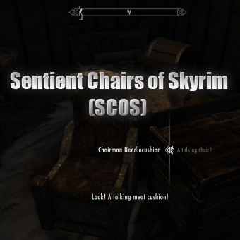

# Sentient Chairs of Skyrim (SCOS) (Preview)

A Skyrim Special Edition mod By Mark E. Kraus.

My mods:

* [Cheat Jewelry](https://www.nexusmods.com/skyrimspecialedition/mods/58973)
* [Cheat Powers](https://www.nexusmods.com/skyrimspecialedition/mods/58892)
* [Exit Combat Power](https://www.nexusmods.com/skyrimspecialedition/mods/58651)
* [Sentient Chairs of Skyrim (SCOS)](https://www.nexusmods.com/skyrimspecialedition/mods/59604)

## About Sentient Chairs of Skyrim (SCOS)

This mod adds a sentient race of chairs to the world of Skyrim.

This mod is intended to add a bit of humor to the game. It started as a joke between friends, but after rigging up a demo of a sentient chair and laughing hard, I decided to make this into a full mod.

I plan to add more Chair NPCs, a few quests, and possibly a dungeon.

## Sentient Chair Lore

In the first century following the end of the Oblivion Crisis, many chairs in Skyrim developed the properties of Black Soul Gems. Upon absorbing the souls of sentient beings, these chairs became sentient themselves. These chairs gained the ability to procreate and soon formed a race of their own native to Skyrim.

Chairs are nearly immortal as they are completely resistant to aging, disease, and poisons. They live as long as they remain intact. However, They can be killed. Being made of wood, they are weak to fire.

Sentient Chair's lineage from actual chairs has made them proficient at pickpocketing, shock magic, and sneaking (no one suspects a chair!). Sentient chairs lack hands and cannot wield weapons. Also, the craftsmen of Skyrim have not made armor for chairs. Luckily for the chairs, they are made of sturdy wood that provides the same protection as armor.

Unfortunately, Nords hunted Chairs as trophies to near extinction. Few chairs from the first generations survive today, and chairs in Skyrim no longer become sentient on their own. How chairs became sentient in the first place is a mystery lost to time.

## Features

### Voiced Sentient Chair NPCs

* Chairman Needlecushion (Winterhold - Frozen Hearth Inn)
* Thurston Snugglebottoms (Whiterun - Dragonsreach )

### Leveled NPCs

Chair Wizard Bandits - Some chairs of Skyrim have taken to banditry and lurk anywhere you can find bandit wizards.

Warlock Chairs - The magick skills of Sentient Chairs make them excellent warlocks. They practice every discipline except fire. Some of the best Storm Warlocks in Skyrim are chairs! Warlock Chairs inhabit any hovel where warlocks hone their craft.

* Conjurers
* Ice Mages
* Necromancers
* Storm Mages
* Storm Mage Bosses

### Loading Screens

Nine (9) loading screens have been added that contain sentient chair lore and information about specific sentient chairs.

### Dead Chair Loot

All Sentient Chairs drop firewood and a filled black soul gem. Leveled NPCs also drop the normal loot found in similar NPCs.

## Installation

### Requirements

[Unofficial Skyrim Special Edition Patch](https://www.nexusmods.com/skyrimspecialedition/mods/266) must be installed before installing this mod.

### Recommended

[Static Mesh Improvement Mod - SMIM](https://www.nexusmods.com/skyrimspecialedition/mods/659). Will improve the looks of Chair NPCs.

### NMM/Vortex

Download and install with Vortex and the FOMOD installer will take care of the rest.

### Manual

* Extract the 7z file using 7-Zip.
* Copy the extracted `MarkekrausSentientChairsOfSkyrim.esp` and `MarkekrausSentientChairsOfSkyrim.bsa` files to the `data` folder under your Skyrim: Special Edition installation folder.
* Enable the plugin using whatever method you usually use.

### Load Order

This mod should be placed somewhere after the [Unofficial Skyrim Special Edition Patch](https://www.nexusmods.com/skyrimspecialedition/mods/266) and before any mods that change NPC behaviors.

## User Guide

Visit the NPCs, have a chat, interact with them!

## Compatibility

This mod should be compatible with everything. However, any mods which change vanilla chair meshes may change the look of the Chair NPCs in unexpected ways.

If there is a particular NPC behavior mod that you would like this mod to be affected by, request it in the discussion. This mod should be compatible with any of them, but Chair NPCs may not be completely affected.

I have confirmed the NPCs in this mod can be controlled by [Amazing Follower Tweaks SE](https://www.nexusmods.com/skyrimspecialedition/mods/6656). If you want to add the Sentient Chairs as followers, I suggest using AFT.

## Warning: Not Lore-Friendly and Swearing

This mod should be compatible with everything. However, any mods which change vanilla chair meshes may change the look of the Chair NPCs in an unexpected way.

If there is a particular NPC behavior mod that you would like this mod to be affected by, request it in the discussion. This mod should be compatible with any of them, but Chair NPCs may not be completely affected.

The dialogue in this mod may contain language that may not be appropriate for all audiences.
